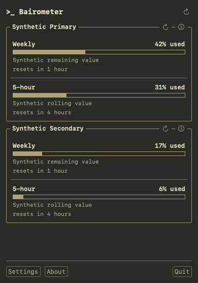

# 🖥️ Bairometer — AI capacity monitor

> macOS menu bar app for viewing normalized AI provider usage —
> all your limits in one compact place.

## Why

Checking AI provider usage limits usually means opening each provider's page
separately. Bairometer brings them together in one menu bar dropdown — with
honest labels for what's live, what's estimated, and what needs attention.

No real provider credentials are required to start.

## Features

- One menu bar panel for all your AI provider usage limits
- Normalized snapshots — live, delayed, local estimates, or manual
- Configurable refresh interval (manual by default)
- Stale-snapshot flags so you know when data is outdated
- Dashboard height presets: Compact, Standard, Tall
- English and Russian localization with immediate language switching
- Locale-aware dates, percentages, and relative reset times
- Menu-bar-only — no Dock icon, no main window

## Providers

| Provider | Source | Data Type |
| --- | --- | --- |
| **OpenAI Codex** | App-server | 🟢 Live rate-limit windows |
| **Claude Code** | Helper + `/usage` CLI | 🟡 Local estimate / 🟢 Live plan limits |
| **Ollama Cloud** | Web page (isolated WebKit) | 🟢 Live session/weekly |

Experimental sources are opt-in. A successful experimental read is `OK`;
the `Experimental` label is informational, not a warning.

→ See [`docs/providers/`](docs/providers/) for implementation details.

## Download

**Requirements:** macOS 15+ on Apple Silicon or Intel

Download the matching archive from the
[latest GitHub Release](https://github.com/Prontsevich/ai-limitbar/releases/latest):

The public product name is Bairometer. Release archives and the app bundle
intentionally retain their existing `AILimitBar` technical names for
compatibility:

- `AILimitBar-<version>-arm64.zip` for Apple Silicon Macs
- `AILimitBar-<version>-x86_64.zip` for Intel Macs

Unpack the archive and move `AILimitBar.app` to Applications; its displayed
name is Bairometer.

New releases created through the verified draft flow will be signed with a
Developer ID Application certificate and notarized by Apple. Historical
releases may use a different signing and notarization policy; check the details
of the release you download.

## Roadmap

**Done ✅** — Core app, persistence, Claude Code, refresh coordination, account
model, dashboard redesign, settings, Ollama web source, Codex app-server, SQLite
migration, terminal dashboard, Settings redesign, Claude `/usage` CLI, English
and Russian localization, General Settings, and GitHub Release distribution.

**Planned directions 📋** — additional provider research, per-limit thresholds,
notifications, dashboard appearance, and a passive WidgetKit extension.

## Documentation

| Document | Description |
| --- | --- |
| [`docs/plan.md`](docs/plan.md) | Product plan, provider research, architecture |
| [`docs/tasks.md`](docs/tasks.md) | Roadmap scope, acceptance criteria, and completed-history evidence |
| [`docs/dashboard-design.md`](docs/dashboard-design.md) | Dashboard design contract |
| [`docs/settings-design.md`](docs/settings-design.md) | Settings design contract |
| [`docs/providers/`](docs/providers/) | Per-provider implementation notes |
| [`CHANGELOG.md`](CHANGELOG.md) / [`CHANGELOG.ru.md`](CHANGELOG.ru.md) | Bilingual release-note source |

Private strategy, priorities, project documents, and implementation tasks are
managed in Linear. GitHub is the public surface for source code, pull requests,
releases, and user-reported bugs or feature requests. Private Linear issue IDs
and planning discussions are not copied into public branches, commits, issues,
or pull requests.

GitHub Releases use bilingual notes rendered from the reviewed changelog
sources, with private planning details removed.

## Contributing

See [`CONTRIBUTING.md`](CONTRIBUTING.md) for build instructions, development
setup, and release procedures.

## Feedback And Support

Report bugs and feature ideas through the public
[GitHub issue forms](https://github.com/Prontsevich/ai-limitbar/issues/new/choose), send
direct feedback to [prontsevich@gmail.com](mailto:prontsevich@gmail.com), or
message [@s_prontsevich](https://t.me/s_prontsevich) on Telegram.

If you find Bairometer useful, consider supporting its continued development.

## License

MIT. See [`LICENSE`](LICENSE).
